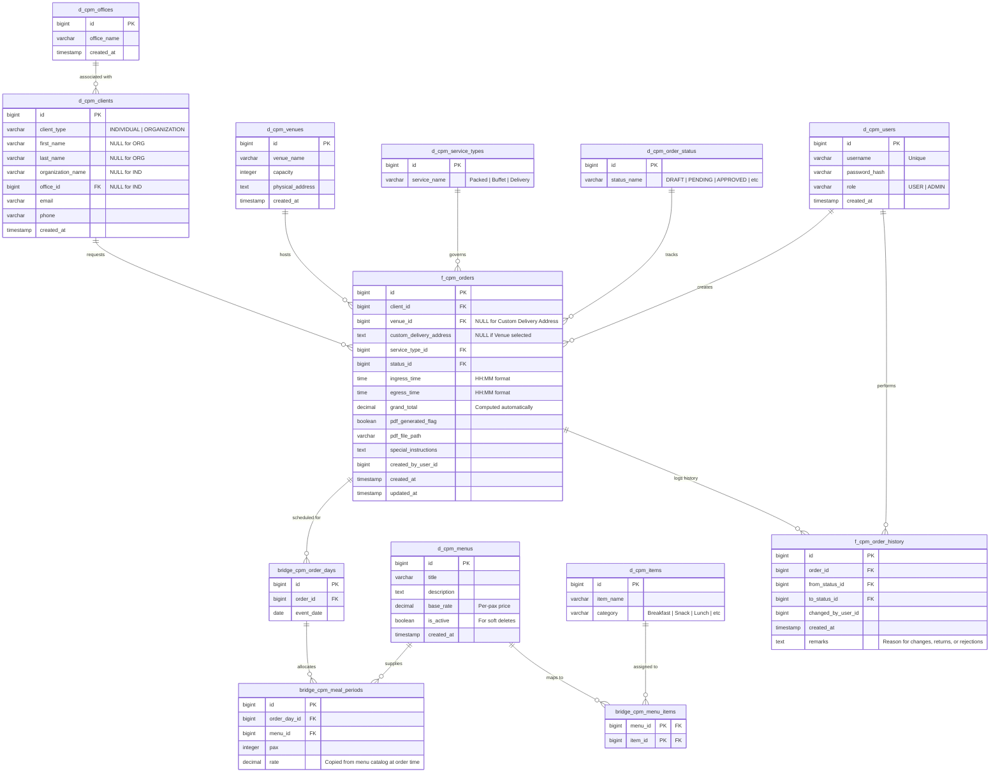

# Project Documentation — Project Itadakimasu (CPM Order Monitoring System)

This is the comprehensive project documentation package for **Project Itadakimasu** (the CPM - Catering & Packed Meals - Order Monitoring System). The project code name "Itadakimasu" is a Japanese term which humbly translates to *"I gratefully receive"*. This package compiles and standardizes the requirements, architecture decisions, database models, security rules, implementation timelines, and governance procedures for the system.

> [!NOTE]
> Although the project's internal engineering code name is **Project Itadakimasu**, all user-facing application page headers, titles, branding logos, and UI elements will continue to display as **CPM Order Monitoring System**.

---

## 1. Project Overview & Objectives

### Project Purpose
Project Itadakimasu (the Catering & Packed Meals / CPM Order Monitoring System) is a secure, web-based portal designed to replace the manual, error-prone spreadsheet process used for managing catering requests. The manual system suffered from inconsistent data formatting (such as free-text date ranges like "March 16 to..." or "TBA" in temporal fields) and client duplication (such as "Copy of" naming strings). The new CPM portal enforces referential data integrity, structures multi-day scheduling, computes billing dynamically, validates inputs, and secures records via a formal approval state machine.

### Business Goals & Success Criteria
* **Eliminate Data Inconsistency**: Enforce database-level type checking and lookup constraints to prevent unparsable values.
* **Reduce Admin Overhead**: Automate order subtotals and invoice computations to prevent mathematical discrepancies.
* **Streamline Operations**: Replace manual notifications and file copies with centralized, status-driven dashboard queues.
* **Establish Accountability**: Track all order revisions and status adjustments through an immutable, chronological history ledger.
* **Responsive Usability**: Optimize portal layouts to run seamlessly on responsive web browsers across laptop, tablet, and mobile displays.

### Scope Definition
```
+----------------------------------------------------+---------------------------------------------------+
|               In Scope (Phase 1)                   |               Out of Scope (Phase 2)              |
+----------------------------------------------------+---------------------------------------------------+
| * Normalized PostgreSQL Database Schema            | * Real-time Ingredient Inventory Checks           |
| * Separation of Individual vs. Org Clients         | * Automated Raw Ingredient Margin Costing (COGS)  |
| * Multi-Day Order Scheduling & Meal Mappings       | * Client SMS & Email Gateway Notifications        |
| * Strict Datetime & Ingress/Egress Constraints     | * Native Mobile Application                       |
| * Role-Based Access Control & JWT Authentication   |                                                   |
| * Order State Machine & Edit Locking Logic         |                                                   |
| * Immutable Audit Trail Logs                       |                                                   |
| * Dynamic Financial Cost Calculations              |                                                   |
| * Static Print-Ready PDF Invoice Generation        |                                                   |
+----------------------------------------------------+---------------------------------------------------+
```

### Stakeholders & Roles
* **User (Client/Staff Representatives)**: Submits order requests, reviews estimated quotes, coordinates event date logistics, and modifies drafts.
* **Admin (Operations Leads/Admins)**: Manages clients, venues, items, and pricing catalogs; reviews, approves, returns, or rejects orders; views audit logs.
* **System**: The backend server which handles JWT signature verifications, automatic cost computations, database status transitions, and PDF rendering triggers.

### Assumptions & Constraints
* **Assumptions**: 
  - A PostgreSQL database instance will be hosted with consistent uptime.
  - Client representatives possess standard internet connectivity to access the responsive web app.
* **Constraints**:
  - The Phase 1 system must be delivered within a 12-week development lifecycle.
  - System notifications are limited to in-app cues and status changes (no SMS/email triggers in Phase 1).

---

## 2. Architecture Overview

The system is structured as a unified full-stack application built with Next.js, emphasizing data integrity, responsive web interactions, and fast page response rates.

```
       +-------------------------------------------------------------+             +---------------------+
       |                       Next.js (App Router)                  |             |     Data Layer      |
       |  +-----------------------+       +-----------------------+  |             | PostgreSQL Database |
       |  |     Presentation      |       |      Application      |  | <=========> | (Accessed via       |
       |  | React 19 + TypeScript | <===> | Route Handlers + JWT  |  |             |  Drizzle ORM)       |
       |  |  + Tailwind CSS v4    |       |      Middleware       |  |             +---------------------+
       |  +-----------------------+       +-----------------------+  |
       +-------------------------------------------------------------+
                                       ||
                                       \/
                             +-------------------+
                             |  Custom PDF Gen   |
                             | (Manual Builder)  |
                             +-------------------+
```

* **Application Framework**: A unified full-stack web application built using **Next.js** (App Router, version 16.x) with **React 19**, **TypeScript**, and **Tailwind CSS v4** for styling.
* **Backend API & Middleware**: Next.js Route Handlers (API routes) power the backend services. Incoming requests are intercepted and verified via Next.js Edge Middleware using a custom session encryption strategy.
* **Database & ORM**: **PostgreSQL** relational database, accessed and managed using **Drizzle ORM** (version 0.45.x) for type-safe queries and schema migrations. The database layer utilizes standard indexing, relational keys, and constraint checks.
* **Integrations**:
  - *Data Warehouse (DWH) Sync*: Synchronizes company-wide department lists into the office dictionary (`d_cpm_offices`) for internal request tracking.
  - *PDF Generator*: A custom PDF generation utility in [pdf.ts](file:///home/ronald/MyProjects/cpm/src/lib/pdf.ts) that writes raw PDF syntax directly to the filesystem to generate static invoices upon order approval without the overhead of a headless browser.
* **Infrastructure**: Packaged inside Docker containers and deployed across isolated environments (Development, Staging, Production). Automated CI/CD workflows run unit tests and bundle assets on deployment.

---

## 3. Entity Relationship Diagram (ERD)

The database schema is fully normalized to guarantee referential integrity and eliminate redundant, duplicate data entries.



---

## 4. Data Model Specification

The database schemas are defined and managed using [Drizzle ORM](https://orm.drizzle.team/) mapping directly to a PostgreSQL database. The full schema definition is located at [schema.ts](file:///home/ronald/MyProjects/cpm/src/lib/db/schema.ts).

### 4.1 Master Dimension Tables

#### `d_cpm_offices`
Holds the directory of organizational offices.
* **Primary Key**: `id` (BIGINT)
* **Fields**:
  - `office_name` (VARCHAR, Not Null, Unique)
  - `created_at` (TIMESTAMP, default NOW())
* **Indexing**: Unique index on `office_name`.

#### `d_cpm_clients`
Stores corporate entities and individual private clients in a unified structure.
* **Primary Key**: `id` (BIGINT)
* **Fields**:
  - `client_type` (VARCHAR, Not Null) - Enforces `'INDIVIDUAL'` or `'ORGANIZATION'`.
  - `first_name` (VARCHAR, Nullable)
  - `last_name` (VARCHAR, Nullable)
  - `organization_name` (VARCHAR, Nullable)
  - `office_id` (BIGINT, Nullable, FK references `d_cpm_offices.id`)
  - `email` (VARCHAR, Not Null)
  - `phone` (VARCHAR, Not Null)
  - `created_at` (TIMESTAMP, default NOW())
* **Validation Rules**:
  - PostgreSQL Check Constraint:
    ```sql
    CHECK (
      (client_type = 'INDIVIDUAL' AND first_name IS NOT NULL AND last_name IS NOT NULL AND organization_name IS NULL) OR
      (client_type = 'ORGANIZATION' AND organization_name IS NOT NULL)
    )
    ```
  - Standard format verification on `email` and `phone`.

#### `d_cpm_users`
Stores user credentials, hashed passwords, and system roles.
* **Primary Key**: `id` (BIGINT)
* **Fields**:
  - `username` (VARCHAR, Not Null, Unique)
  - `password_hash` (VARCHAR, Not Null) - Hashed using Node's native `scryptSync` algorithm in [auth.ts](file:///home/ronald/MyProjects/cpm/src/lib/auth.ts).
  - `role` (VARCHAR, Not Null) - Enforces `'USER'` or `'ADMIN'`.
  - `created_at` (TIMESTAMP, default NOW(), Not Null)
* **Indexing**: Unique index on `username`.

#### `d_cpm_venues`
Stores capacities and configurations of primary event locations.
* **Primary Key**: `id` (BIGINT)
* **Fields**:
  - `venue_name` (VARCHAR, Not Null, Unique)
  - `capacity` (INTEGER, Not Null, must be > 0)
  - `physical_address` (TEXT, Not Null)
  - `created_at` (TIMESTAMP)

#### `d_cpm_service_types`
Predefined lookup table for service styles.
* **Primary Key**: `id` (BIGINT)
* **Fields**:
  - `service_name` (VARCHAR, Unique) - e.g., `'Packed Meal'`, `'Buffet Set-up'`, `'Delivery Only'`.

#### `d_cpm_order_status`
Enums defining the lifecycle states of orders.
* **Primary Key**: `id` (BIGINT)
* **Fields**:
  - `status_name` (VARCHAR, Unique) - `'DRAFT'`, `'PENDING_APPROVAL'`, `'APPROVED'`, `'FOR_UPDATE'`, `'CANCELLED'`.

#### `d_cpm_menus`
Stores menu lists and base per-pax pricing.
* **Primary Key**: `id` (BIGINT)
* **Fields**:
  - `title` (VARCHAR, Not Null, Unique)
  - `description` (TEXT)
  - `base_rate` (DECIMAL(12, 2), Not Null, >= 0.00)
  - `is_active` (BOOLEAN, default TRUE)
* **Usage Notes**: Soft delete is enforced. If a menu is removed, set `is_active = FALSE`. Do not perform physical deletes to preserve references on historical order records.

#### `d_cpm_items`
Detailed catalog of discrete food items.
* **Primary Key**: `id` (BIGINT)
* **Fields**:
  - `item_name` (VARCHAR, Not Null, Unique)
  - `category` (VARCHAR) - e.g., `'Breakfast'`, `'AM Snack'`, `'Lunch'`, `'PM Snack'`, `'Dinner'`.

### 4.2 Bridge & Junction Tables

#### `bridge_cpm_menu_items`
Links individual food items to larger menu catalogs.
* **Composite Primary Key**: `(menu_id, item_id)`
* **Foreign Keys**:
  - `menu_id` references `d_cpm_menus.id` (ON DELETE RESTRICT)
  - `item_id` references `d_cpm_items.id` (ON DELETE RESTRICT)

#### `bridge_cpm_order_days`
Represents single days allocated to an event order.
* **Primary Key**: `id` (BIGINT)
* **Fields**:
  - `order_id` (BIGINT, FK references `f_cpm_orders.id` ON DELETE CASCADE)
  - `event_date` (DATE, Not Null)
* **Constraints**:
  - Unique composite index on `(order_id, event_date)` to block duplicate dates.

#### `bridge_cpm_meal_periods`
Maps specific meals, pax counts, and menus to specific event dates.
* **Primary Key**: `id` (BIGINT)
* **Fields**:
  - `order_day_id` (BIGINT, FK references `bridge_cpm_order_days.id` ON DELETE CASCADE)
  - `menu_id` (BIGINT, FK references `d_cpm_menus.id` ON DELETE RESTRICT)
  - `pax` (INTEGER, Not Null, must be > 0)
  - `rate` (DECIMAL(12, 2), Not Null, >= 0.00)
* **Usage Notes**: The rate field is copied from `d_cpm_menus.base_rate` when the order is generated to act as a historical freeze point. Subsequent updates to default menu pricing won't alter historical orders.

### 4.3 Fact & Audit Tables

#### `f_cpm_orders`
Stores order header metadata and aggregate totals.
* **Primary Key**: `id` (BIGINT)
* **Fields**:
  - `client_id` (BIGINT, FK references `d_cpm_clients.id`)
  - `venue_id` (BIGINT, FK references `d_cpm_venues.id`, Nullable)
  - `custom_delivery_address` (TEXT, Nullable)
  - `service_type_id` (BIGINT, FK references `d_cpm_service_types.id`)
  - `status_id` (BIGINT, FK references `d_cpm_order_status.id`)
  - `ingress_time` (TIME, Nullable)
  - `egress_time` (TIME, Nullable)
  - `grand_total` (DECIMAL(12, 2), default 0.00)
  - `pdf_generated_flag` (BOOLEAN, default FALSE)
  - `pdf_file_path` (VARCHAR, Nullable)
  - `special_instructions` (TEXT, Nullable)
  - `created_by_user_id` (BIGINT)
  - `created_at` (TIMESTAMP, default NOW())
  - `updated_at` (TIMESTAMP, default NOW())
* **Validation Rules**:
  - Ingress and egress times must be formatted as discrete 24-hour time variables (HH:MM) or NULL. Free text string variables (such as "TBA") are rejected.
  - If `venue_id` is null, `custom_delivery_address` is required.
* **Indexing recommendations**:
  - Indexes on `client_id` and `status_id`.

#### `f_cpm_order_history`
Chronological, immutable system audit log.
* **Primary Key**: `id` (BIGINT)
* **Fields**:
  - `order_id` (BIGINT, FK references `f_cpm_orders.id` ON DELETE CASCADE)
  - `from_status_id` (BIGINT, FK references `d_cpm_order_status.id`)
  - `to_status_id` (BIGINT, FK references `d_cpm_order_status.id`)
  - `changed_by_user_id` (BIGINT)
  - `remarks` (TEXT)
  - `created_at` (TIMESTAMP, default NOW())
* **Constraints**:
  - The database rules block updates or deletes on this table to preserve auditing history.

---

## 5. Coding Standards & Conventions

### Development Standards
* **Naming Styles**:
  - Database: `snake_case` for schemas, tables, fields, and constraints.
  - APIs and JSON Payloads: `camelCase` for properties and variables.
  - Frontend: `camelCase` for helper functions and hooks; `PascalCase` for React components.
* **Folder Architecture**:
  - The application is organized as a unified full-stack Next.js project:
    ```
    /cpm (root)
      /drizzle            # Drizzle ORM schema migrations and config outputs
      /public             # Static assets (images, logos, and generated invoices)
      /src
        /app              # Next.js App Router folders (pages, API routes)
          /api            # Next.js API endpoints (Route Handlers)
            /auth         # Authentication endpoints
            /catalogs     # Catalogs and master settings endpoints
            /clients      # Clients endpoints
            /orders       # Orders, state updates, and history endpoints
          /favicon.ico
          /globals.css    # Global Tailwind CSS definitions
          /layout.tsx     # Root HTML and shell layouts
          /page.tsx       # Main portal login/dashboard entry point
        /lib              # Reusable modules and utilities
          /db             # Database client connection and Drizzle schema
            /schema.ts    # Main Drizzle schema definitions
          /auth.ts        # Password hashing and verification functions
          /auth-jwt.ts    # AES-GCM session encrypt/decrypt functions
          /pdf.ts         # Custom manual PDF invoice generation utility
          /serialize.ts   # Serialization utilities for handling BigInt in JSON
        /middleware.ts    # Next.js Edge middleware for authentication and route guarding
    ```
* **API Standardization**:
  - Endpoints return envelopes containing transaction statuses:
    ```json
    // Success Response Sample
    {
      "success": true,
      "data": { "orderId": 101, "status": "DRAFT" }
    }

    // Failure Response Sample
    {
      "success": false,
      "error": {
        "code": "LOCK_CONSTRAINT_ERROR",
        "message": "Approved orders cannot be modified."
      }
    }
    ```
* **Error Handling**: Next.js API Route Handlers are wrapped in exception handlers. Database constraint triggers and validations are caught and mapped directly to user-friendly messages and appropriate HTTP Status Codes (e.g., 400 for bad parameters, 403 for access validation errors).
* **Logging & Monitoring**: Winston handles structured application-level execution logs. API endpoints are monitored using response tracers to ensure query hydration resolves in under 300ms.

---

## 6. Security & Compliance

### Authentication & Authorization
* Access is verified using a custom encrypted session token (AES-GCM encryption) containing the user's ID, username, and role, managed via [auth-jwt.ts](file:///home/ronald/MyProjects/cpm/src/lib/auth-jwt.ts).
* The session token is stored in a secure, `httpOnly` cookie named `token`.
* Next.js Edge Middleware ([middleware.ts](file:///home/ronald/MyProjects/cpm/src/middleware.ts)) intercepts API routes, decrypts the token, checks its age, deletes expired sessions (12-hour limit), and injects session data (`x-user-id`, `x-username`, and `x-role`) as HTTP request headers for downstream API endpoints.

### Access Control Matrix

| System Resource | HTTP Method | `USER` Access Rule | `ADMIN` Access Rule |
| :--- | :--- | :--- | :--- |
| **`/api/auth/login`** | `POST` | Permitted (Anonymous) | Permitted (Anonymous) |
| **`/api/clients`** | `GET` | Read client profiles | Full registry read |
| **`/api/clients`** | `POST` | Create client profiles | Full CRUD client access |
| **`/api/orders`** | `POST` | Create draft orders | Create draft orders |
| **`/api/orders/:id`** | `GET` | Read own orders (RLS enforced) | View all system orders |
| **`/api/orders/:id`** | `PUT` | Edit own orders (if DRAFT/FOR_UPDATE) | Full edit access |
| **`/api/orders/:id/submit`**| `POST` | Permitted (Transitions to PENDING) | Blocked (Role restriction) |
| **`/api/orders/:id/cancel`**|`POST` | Permitted (Transitions to CANCELLED) | Permitted (Transitions to CANCELLED) |
| **`/api/orders/:id/approve`**|`POST` | Blocked (Role restriction) | Permitted (Transitions to APPROVED)|
| **`/api/orders/:id/return`**| `POST` | Blocked (Role restriction) | Permitted (Transitions to FOR_UPDATE)|
| **`/api/orders/:id/pdf`** | `GET` | Retrieve invoice PDF | Retrieve invoice PDF |

### Security Safeguards
* **Row-Level Security (RLS)**: Implemented on `f_cpm_orders` table layers. Standard client representatives can only fetch, search, or edit orders that match their `created_by_user_id`. Administrators bypass this scope to retrieve all records.
* **Edit-Lock Validation**: Trigger checks are active during both API execution and database writes. If `f_cpm_orders.status` matches `PENDING_APPROVAL` or `APPROVED`, the database aborts modification attempts from `USER` profiles.
* **Sensitive Data Handling**: All credentials are encrypted. User PII is stored behind authorized middleware. Passwords use standard Node.js native `scryptSync` hashing (with unique salts and timing-safe equality verification) in [auth.ts](file:///home/ronald/MyProjects/cpm/src/lib/auth.ts), not `bcrypt`.

---

## 7. Project Phases

The Phase 1 system is organized into a structured 12-week development timeline.

```
       W1-2: Discovery & Requirements  ====>  W3-4: DB & Data Modeling  ====>  W5-7: Backend APIs
                                                                                       ||
                                                                                       \/
       W12: Deployment  <====  W11: QA & Audit  <====  W10: Integration  <====  W8-9: React UI
```

### Phase 1: Discovery & Requirements (Weeks 1 - 2)
* **Objectives**: Define schemas, build design wireframes, and sign off on target system scope.
* **Deliverables**: Signed specifications document, user flow diagrams.
* **Dependencies**: Stakeholder input.
* **Risks**: Unresolved scope expectations from team leads.

### Phase 2: Database Design & Migration (Weeks 3 - 4)
* **Objectives**: Initialize PostgreSQL instance, run schema migrations, populate catalogs.
* **Deliverables**: Database migration script logs, pre-populated seed data files.
* **Dependencies**: Phase 1 specifications.
* **Risks**: Incorrect relationship configurations causing relational circular blocks.

### Phase 3: Backend REST API Development (Weeks 5 - 7)
* **Objectives**: Implement security logic, construct database controllers, validate endpoints.
* **Deliverables**: API application running JWT checks, order controllers, API unit tests.
* **Dependencies**: Phase 2 database.
* **Risks**: Lock constraints bypassing during concurrency requests.

### Phase 4: Frontend Portal Development (Weeks 8 - 9)
* **Objectives**: Construct single-page layouts, build the multi-step order booking wizard.
* **Deliverables**: UI dashboard views, client-side input validations.
* **Dependencies**: Phase 3 controllers (run in parallel using API mock values).
* **Risks**: High state complexity in the multi-day booking calendar form.

### Phase 5: Integration & Export Services (Week 10)
* **Objectives**: Connect React views to REST endpoints, set up custom PDF exports.
* **Deliverables**: End-to-end operational portal generating invoices on the server.
* **Dependencies**: Backend endpoints and frontend components.
* **Risks**: Complexity of manual PDF generation coordinates and stream formatting.

### Phase 6: QA Testing & Security Auditing (Week 11)
* **Objectives**: Execute integration validations, audit access matrix limits.
* **Deliverables**: Quality Assurance logs, security analysis report.
* **Dependencies**: Fully integrated application.
* **Risks**: Flaky rendering tests on static PDF file generators.

### Phase 7: Deployment & Delivery (Week 12)
* **Objectives**: Set up production Docker container infrastructure, deploy live system database.
* **Deliverables**: Live production website.
* **Dependencies**: QA validation approval.
* **Risks**: Version mismatch on environment variables during build execution.

### Phase 8: Operations Support & Updates (Ongoing)
* **Objectives**: Perform database maintenance checks, resolve runtime user issues.
* **Deliverables**: Bug fix updates, performance latency logs.
* **Dependencies**: Live production build.
* **Risks**: High concurrency delays on server resources.

---

## 8. Task Breakdown & Timeline

```
Week  1  2  3  4  5  6  7  8  9 10 11 12
----------------------------------------
Ph 1  [===]
Ph 2     [===]
Ph 3        [======]
Ph 4                 [===]
Ph 5                       [=]
Ph 6                          [=]
Ph 7                             [=]
```

### Detailed Tasks
* **Task 1.1: Finalize Specification Specs (1 Week)**
  - Establish fields and layout limits.
  - Critical Path item.
* **Task 2.1: Establish PostgreSQL Infrastructure (1 Week)**
  - Provision server instance and configuration schemas.
  - Dependency: Task 1.1.
* **Task 2.2: Setup Migrations & Dimension Tables (1 Week)**
  - Build migration files and default catalog seeds.
* **Task 3.1: Build Authentication System (1 Week)**
  - Implement JWT middleware structures and logins.
* **Task 3.2: Implement Order & Client Controllers (2 Weeks)**
  - Write CRUD endpoints and state checking controls.
  - Critical Path item.
* **Task 4.1: Build React Layouts & Navigation (1 Week)**
  - Design UI layouts and access dashboards.
* **Task 4.2: Build Order Wizard Components (1 Week)**
  - Build date selectors and subtotal calculators.
  - Critical Path item.
* **Task 5.1: Integrate APIs & Hook Elements (3 Days)**
  - Connect client side triggers to API routes.
* **Task 5.2: Configure Custom PDF Exporters (4 Days)**
  - Write template codes and output storage scripts.
* **Task 6.1: Run End-to-End Testing Cases (1 Week)**
  - Audit lock limits and check validations.
* **Task 7.1: Setup Docker & Production Launch (1 Week)**
  - Configure production environment variables and deploy.

---

## 9. Completed Tasks

The initial preparation phase has been completed. The core architecture team has delivered the following:

* **Database Schema Definitions**: Selected PostgreSQL structure, established table normalization models, and defined client organization splits. (Completed 2026-07-09)
* **State Machine & Locking Design**: Defined state transitions (`DRAFT` -> `PENDING_APPROVAL` -> `APPROVED` / `CANCELLED` / `FOR_UPDATE`) and edit-locking constraints. (Completed 2026-07-09)
* **Functional Spec & User Stories**: Documented and approved system requirements and client test stories. (Completed 2026-07-09)
* **Impact**: System specifications are frozen. The development team is ready to bootstrap the database and code repositories.

---

## 10. Next Steps & Future Improvements

### Next Immediate Steps
1. Initialize the PostgreSQL repository with standard migration structures.
2. Build JWT user middleware services on Node.js.
3. Establish the base Git repository layout.

### Recommended Enhancements (Phase 2)
* **Ingredient Inventory Mapping**: Link system meals to stock inventory layers.
* **COGS Automated Pricing**: Enable recipe costing logic based on ingredient costs.
* **Automated Notification Gateway**: Send real-time client alerts via SMS or Email during status transitions.
* **PDF Enhancement**: Migrate from manual PDF template generation to a high-fidelity rendering engine or library (like React-PDF or Puppeteer) if complex layout styling is required in Phase 2.

---

## 11. Acceptance Criteria

To sign off a task as **"Done"**, it must satisfy the following criteria:

* **Client Profile Registry**:
  - `client_type` validation blocks database entry if organizations lack corporate names or individuals lack contact names.
  - Validated by unit-testing PostgreSQL check constraints.
* **Multi-day Scheduling & Pricing**:
  - Wizard form correctly calculates subtotal and grand total prices using `pax * catalog_rate`.
  - Manual overrides of calculated total values are blocked.
  - Validated by browser integration scripts.
* **State Machine Lock Controls**:
  - API and database reject modification queries to orders with status `'PENDING_APPROVAL'` or `'APPROVED'`.
  - Audited updates trigger automatic writes to history logging tables.
  - Validated by API endpoint boundary tests.
* **PDF Exporter Engine**:
  - System generates printable PDF document files.
  - Output is stored in storage directories, and database indicators update.
  - Validated by file verification checks.
* **Project Sign-off**:
  - Requires validation approvals from the **Product Owner** and the **Lead Technical Architect**.

---

## 12. Change Management

* **Requirement Adjustments**: If project scope adjustments are requested, developers must estimate their impact on database structures and locking policies. Approved adjustments are logged in `DECISIONS.md`.
* **Version Control Workflow**: The team uses standard Git workflow models. Development occurs on branch names starting with `feature/` or `bugfix/` and merges to the `main` branch via Pull Requests.
* **Documentation Maintenance**: Any configuration changes require updates to `FUNCTIONAL-SPEC.md` to ensure project files remain accurate.

---

## 13. Testing Strategy

```
  +-------------------------------------------------------------+
  |  Unit Tests      ->  Verifies inputs, time formats, & rules |
  |  Integration     ->  Checks DB triggers, transactions, & RLS|
  |  E2E UI Tests    ->  Validates booking wizard and submission  |
  |  Load Testing    ->  Confirms latency stays <300ms at scale |
  |  User Acceptance ->  Final operations team manual sign-off  |
  +-------------------------------------------------------------+
```

* **Unit Testing**: Validates date formats, phone number limits, and email input checks.
* **Integration Testing**: Verifies multi-day schedule insertions run as single transactions, database locking triggers fire, and history tracking records are written properly.
* **End-to-End (E2E) Testing**: Simulates users booking multi-day events, submitting requests, and administrators reviewing and approving orders.
* **Load/Performance Testing**: Verifies dashboard query and load speeds remain under 300ms under simulated loads of 10,000 orders.
* **User Acceptance Testing (UAT)**: Operations staff test order bookings on a staging environment.

---

## 14. Deployment Checklist

### Pre-Deployment Checks
* Confirm all migration scripts run and verify correct table structures.
* Populate master catalogs (menus, items, venues) with seed data.
* Set up configuration variables (`DATABASE_URL`, `JWT_SECRET`, `PDF_OUTPUT_DIR`).

### Verification Steps
* Ping healthcheck API endpoints.
* Create a test order draft, verify pricing calculations, and submit the order.
* Verify the test order record is correctly updated in the PostgreSQL database.
* Approve the test order using an admin profile and verify the invoice PDF is successfully generated and stored.

### Rollback Strategy
* Revert server deploy configurations to the previous stable release version.
* Run rollback database migration files (`npm run db:migrate:undo`).
* Verify operations restore to the previous stable state.

---

## 15. Glossary

* **CPM**: Catering & Packed Meals.
* **Pax**: Headcount; the number of guests to serve.
* **Ingress**: The setup window start time prior to the event.
* **Egress**: The cleanup and pack-out window end time following the event.
* **ADR**: Architecture Decision Record.
* **RLS**: Row-Level Security.
* **JWT**: JSON Web Token.
* **DWH**: Data Warehouse.

---

## 16. Stakeholder Communication Plan

* **Daily Developer Standup**: Developer check-in to review blocker items and tasks.
* **Weekly Operations Review**: Project manager, developers, and kitchen supervisors review delivery timelines.
* **Bi-Weekly Demo Sessions**: Project developers present working portal updates to product owners.
* **Primary Communication Channels**: Dedicated Slack channels and Git issue logs.
